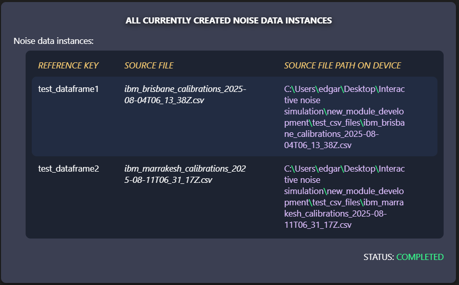
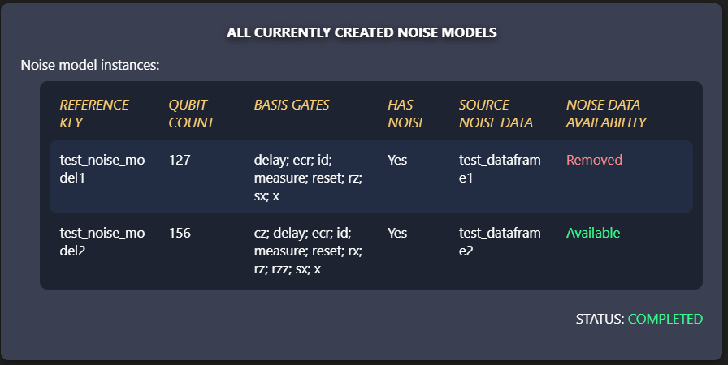
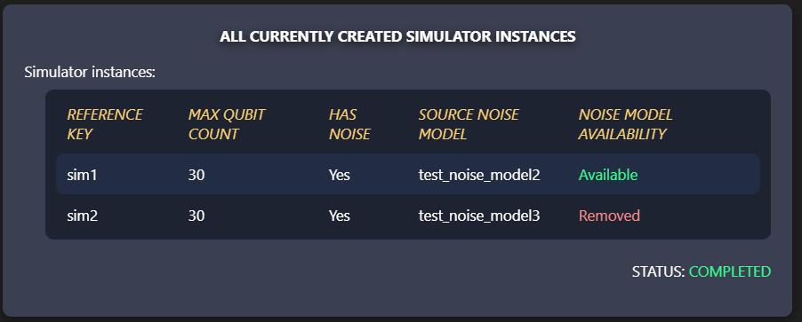

# INS AF2 (Additional Feature 2) - Expanded managingement capabilities

This feature aims to expand the possibilities of users by simplifying the management of multiple simultaneous experiments.

Instead of being limited to a single object (noise data instance, noise model, simulator) for each manager class object, there is an option to store multiple of them at once. Now the user can simply pick which one is required for what task, for example, create noise model *x* with noise data *y*.

## 1. Feature functionality overview

### Main changes:
- **Changes to existing methods for creating instances.** They now create a new instance that will be stored inside of the respective manager class objects. Because of this change, they also require additional arguments:

    ```python
    NoiseDataManager.import_csv_data(
        reference_key: str, 
        file_path: str)

    NoiseCreator.create_noise_model(
        noise_model_reference_key: str, 
        data_reference_key: str,
        has_noise: bool) # Default: True

    SimulatorManager.create_simulator(
        simulator_reference_key: str, 
        noise_model_reference_key: str)
    ```

- **Changes for other methods that were using noise data instances** (viewing qubit noise data, running simulator). They now require the user to specify, which instance is going to be used:
  ```python
  # Looking up multiple qubits - qubits with indexes 1, 10, and 20
  NoiseDataManager.get_qubit_noise_information(
      reference_key="noise_data",
      qubits=[1, 10, 20])
  
  # Running simulator
  result_job = SimulatorManager.run_simulator(
      simulator_reference_key="simulator",
      circuit=circuit, 
      optimization=0, 
      shots=1000)
  ```

- **Added additional methods for viewing and deleting created instances:**

     ```python
    # View all created instances
    NoiseDataManager.view_noise_data_instances()
    NoiseCreator.view_noise_models()
    SimulatorManager.view_simulators()

    # Remove created instance
    NoiseDataManager.remove_noise_data_instance(
        reference_key: str)
    NoiseCreator.remove_noise_model_instance(
        reference_key: str)
    SimulatorManager.remove_simulator_instance(
        reference_key: str)
    ```

    Example of viewing currently created instances:

    

    ***NOTE:** The full file path will only be stored locally, and only while the instances are active. It is purely for informative purposes for the user to remember, where the CSV noise data sources were located at the moment of importing.*

    

    

- It is now possible to **create noiseless noise models and simulators**. As seen in the example for the method `NoiseCreator.create_noise_model()`, an additional argument can be passed: `has_noise`. If this is set to `False`, the noise model will be created without any added errors, but will still contain information about the coupling map and basis gates. For a simulator instance to be noiseless, a noiseless noise model has to be given to it as a source.

### Additional changes:
- **Optimization level is now validated**, when running a simulator. It is no longer possible to pass an optimization level outside of the possible range (0-3).

### Fixes:
- There was an **issue with text stlyes in Jupyter Notebook for tables** - the text color was changing based on selected color theme theme (light=black / dark=white). Now the text will be white regardless of the selected theme (except for situations with added specific styles).

## 2. Additional things to note

These are notes of encountered situations, while developing this update. They may include lessons or conclusions about certain solutions.

### 2.1. Limitations regarding interactive data input

There was an initial idea of simply having a single function, for example, `add_noise_data()`, which would create an output box with form-related *HTML* elements and buttons. This would make this project way more interactive and intuitive. However, there is an issue.

Since the current design solution uses *HTML + JavaScript*, the data will be initially passed to the *JavaScript* functions. This means that the same data should then be passed to *Python* for use - this is the part that isn’t as simple.

Even though there could be a way to get this to work, it would be quite overkill for this kind of project, especially if it is currently meant for Python Notebook files and is run with the help of separate classes. This, along with the fact of there being differences between the environments of *Jupyter Notebook* and *Visual Studio Code*, led to the decision of going for a simpler approach - passing all input data during main class method calls.

### 2.2. Limitations of sending more complicated data structures to *JavaScript* from *Python*

While developing this update, there was a need to create tables for outputting currently created instances. Thus a universal method of creating tables for any similar situation was created. Since the tables could have different column counts, it would be pretty simple to just send over a list of table data cell contents.

This is where an issue was encountered. Even with `json.dumps()`, the received value was interpreted as `null`, meaning that nothing actually went through.

So a workaround was used in the end. Since all data cell values are strings, they were concatenated together with a specific divider string. This way the whole row as string wouldgo through to *JavaScript*, where it gets separated into a list, based on the same separator string.
