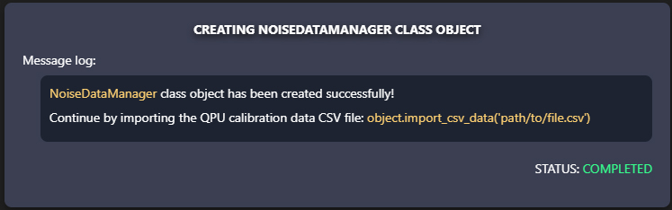
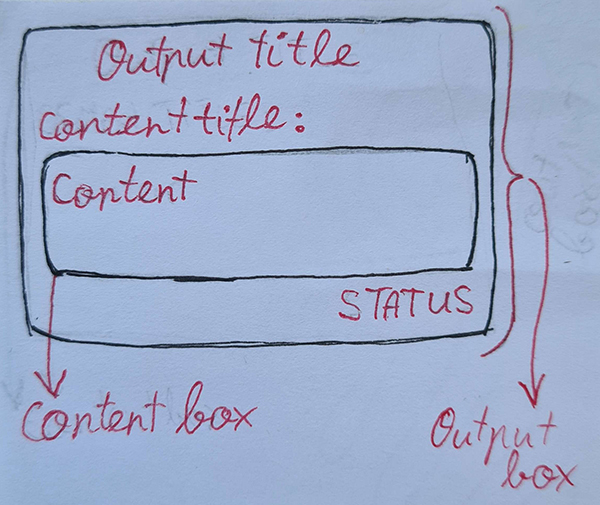

# INS AF1 (Additional Feature 1) - Improved visual output of main module functions

This additional feature aims to replace the generic console outputs of the previous version with something more visually appealing. 

Though it was initially planned to implement this with the library *Python [Rich](https://github.com/Textualize/rich)*, there were some issues in regards to how different cell outputs are handled for *Jupyter Notebook* (*.ipynb*) files thus *Rich* was not used. However, it is possible to render ***HTML*** inside of cell outputs, as well as use ***CSS*** and ***JavaScript*** alongside it - which is the solution that was used.

Alongside the current output stylization upgrades, this feature lays the foundation of being able to add more different outputs for future functionality features with the same new style, as well as the wide possibilities of ***HTML*** + ***CSS*** + ***JavaScript***.

## 1. Feature functionality overview

Main changes:
- Instead of printing out only regular strings as messages for something that happens or showing requested information in a bland and less readable way, each main method (not including helper methods) of the current main classes `NoiseDataManager`, `NoiseCreator`, and `SimulatorManager` now creates a separate output box with multiple content areas for certain types of information that change, based on what kind of method is being used.

**NOTE:** For simplicity sake, these methods will be referred to as "functions" further on in the scope of  this `README.md` file.

Example of new output:



Additional changes:
- Static messages that are stored inside of the `messages.json` file are now sorted into three categories - messages, output-headings, and errors;
- It is now possible to highlight parts of a message under the *message* category inside of `messages.json`, simply by adding the highlightable parts under the *highlightables* key of the desired message.


## 2. General output layout breakdown

New output design sketch:



Each output consists of an **output box** - a container for all renderable content as a result of executing one of the main function.

Every output box has an **output title/heading** that informs users about the expected goal of the current function.

All other content inside of these output boxes is inside of separate **content containers**. Such a container is added for every different type of information being displayed inside of output boxes (message log, error log, qubit noise data, etc.)

Each of these containers consists of two other parts:
- A signle **content title/heading**, for example, *Message log*;
- A single (or many, based on the information being displayed) **content box**, that is another container, inside of which the specific content will be inserted, for example, message log related texts.

At the very bottom of every output box, there is also a **status** indicator that has 3 potential states:
- In progress;
- Completed;
- Failed.

**NOTE:** This terminology is used throughout the newly written code, so an explanation for each of them might have been useful.

## 3. Slight issues with the current solution

### 3.1. Description of the issue
So ***Jupyter Notebook*** works differently if compared to ***Visual Studio Code***. Because of this, it is very hard to find solutions to certain problems - what works on one end, does not on the other. In this case there are empty `div` elements that are generated by `IPython.display.display` that only appear through *Jupyter Notebook*.

Both showing *HTML* content and executing *JavaScript* functions that interact with the displayed *HTML* content is currently acomplished through `IPython.display.display`. The fact that interaction between *HTML* and *JavaScript* is required, as well as that the functions must be called from *Python* code, limits the possibilities of different solutions of running *JavaScript* code, however, `IPython.display.display` is capable of doing this.

The issue comes from the fact that every time `IPython.display.display` is used, a new empty `div` element is created and rendered (not really 'empty', as it contains 2x more `div` elements inside of it, however, they appear as invisible elements with no content).

Now this isn't all too good for 2 reasons:
1. Huge whitespaces appear inside of Jupyter Notebook cell outputs between two output boxes (especially if the function uses a lot of JavaScript functions);
2. Every div is an additional element that exists in the DOM tree, which may eventually cause slight performance issues.

### 3.2. Attempted solutions

#### 3.2.1. Hide the elements through CSS

It is very simple to just hide all of these elements with the help of ***CSS***, however, it's still a lot of unnecessary elements that exist in the *DOM* tree.

For the lack of a better solution, this is something that was used in the end. (Issues about alternative solutions are mentioned further on).

Used *CSS* code:
```css
.jp-OutputArea-child:has(> .jp-OutputArea-output:empty) {
    display: none !important;
}
```

#### 3.2.2. Reusing already created `div` elements for running additional *JavaScript* code

It is possible to do something like this with `IPython.display.display`:
```python
js_display = display(Javascript(f"jsFunction();"), display_id=True)
```

By adding another argument `display_id`, it will return the display instance as an object. If this object is then stored properly, the same display can be reused as follows:
```python
js_display.update(Javascript(f"anotherJsFunction();"))
```

Thus for every output box there will only be a single extra empty `div` element. And after testing this, it was concluded that this solution works in *Jupyter Notebook*.

However, *Visual Studio Code* had some issues, which just broke the main functionality overall...

**NOTE:** The following code example may not include certain changes that are in the most recent final version of the file. The goal here is to give an example as to how this solution was implemented.

Full code that used to try out this solution:
```python
# Standard library imports:
import json, traceback
from importlib import resources

#Third party imports:
from IPython.display import display, HTML, Javascript
from pygments import highlight
from pygments.lexers import PythonTracebackLexer
from pygments.formatters import HtmlFormatter

# Local project imports:
from .. import data, messages


with (resources.files(messages) / "styles.css").open("r", encoding="utf8") as file:
    css_code = file.read()

with (resources.files(messages) / "scripts.js").open("r", encoding="utf8") as file:
    js_code = file.read()

with (resources.files(messages) / "content.html").open("r", encoding="utf8") as file:
    html_code = file.read()

with (resources.files(data) / "messages.json").open("r", encoding="utf8") as file:
    MESSAGES = json.load(file)


class MessageManager:
    
    def __init__(self) -> None:
        """Constructor method """
        self.__content_block: str = f"""
            <style>{css_code}</style>
            <script>{js_code}</script>
            {html_code}
        """
        self.__js_display = None


    def add_message(self, message: str, highlightables: list[str] = None) -> None:
        esc_message = self.__escape_text(message)
        hl_message = self.__highlight_message(esc_message, highlightables)
        self.__js_display.update(Javascript(f"add_message({hl_message});"))


    def add_qubit_noise_data_container(self) -> None:
        self.__js_display.update(Javascript(f"add_qubit_noise_data_container();"))

    def add_qubit_noise_data_row(self, attribute_name: str, value) -> None:
        self.__js_display.update(Javascript(
            f"add_qubit_noise_data_row("
                f"{json.dumps(str(attribute_name))},"
                f"{json.dumps(str(value))});"
        ))

    def add_qubit_noise_data_text_block(self) -> None:
        self.__js_display.update(Javascript(f"add_qubit_noise_data_text_block();"))

    
    def add_traceback(self) -> None:
        self.add_message(f"{MESSAGES["exception_occurred"]}")

        tb_str = self.__get_traceback()

        formatter = HtmlFormatter(full=False, style="lightbulb")
        traceback_html = highlight(tb_str, PythonTracebackLexer(), formatter)
        traceback_css = formatter.get_style_defs()

        escaped_css = json.dumps(traceback_css)
        escaped_html = json.dumps(traceback_html)

        self.__js_display.update(Javascript(
            f"add_traceback_block();"
            f"add_traceback({escaped_css}, {escaped_html});"
            f"set_status({0});"
        ))

        self.__unset_id_values()


    def create_output(self, heading: str) -> None:
        display(HTML(self.__content_block))
        self.__js_display = display(Javascript(f"set_heading('{heading}');"), 
                                         display_id=True)


    def end_output(self) -> None:
        self.__js_display.update(Javascript(f"set_status({1});"))
        self.__unset_id_values()


    def __add_highlight_html(self, text_part: str) -> str:
        return f"<span class='highlighted-text'>{text_part}</span>"


    def __escape_text(self, message: str) -> str:
        escapables = {
            "'": "&#39;",
            "<": "&lt;",
            ">": "&gt;",
            '"': "&quot;",
        }
        for char, replacement in escapables.items():
            message = message.replace(char, replacement)
        return message


    def __get_traceback(self) -> str:
        tb_str = traceback.format_exc()
        
        tb_lines = tb_str.splitlines()
        tb_lines.insert(1, "")
        tb_lines.insert(len(tb_lines)-1, "")
        return "\n".join(tb_lines)


    def __highlight_message(self, message: str, highlightables: list[str] | None) -> str:
        if highlightables:
            for string in highlightables:
                string = self.__escape_text(string)
                hl_string = self.__add_highlight_html(string)
                message = message.replace(string, hl_string)
        return json.dumps(message)


    def __unset_id_values(self) -> None:
        self.__js_display.update(Javascript(
            f"unset_id_values();"
        ))
        self.__js_display = None

```

#### 3.2.3. Automatically removing the unnecessary elements through *JavaScript*

Since *HTML* element IDs are used to edit the current active output box in real time, it is possible to traverse the *DOM* tree. So after inspecting the final *HTML* code through the browser console, a solution was made that removes these empty `div` elements.
