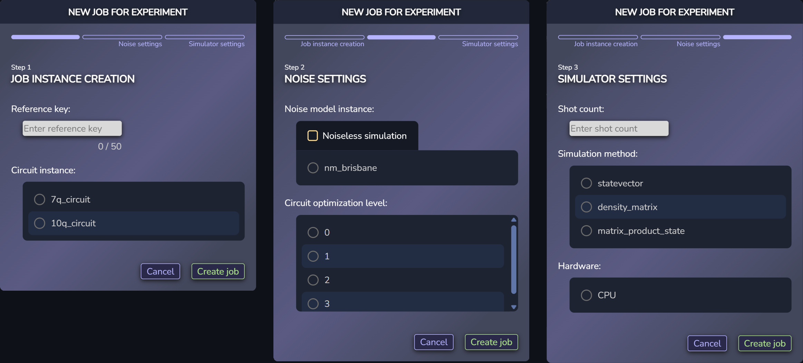
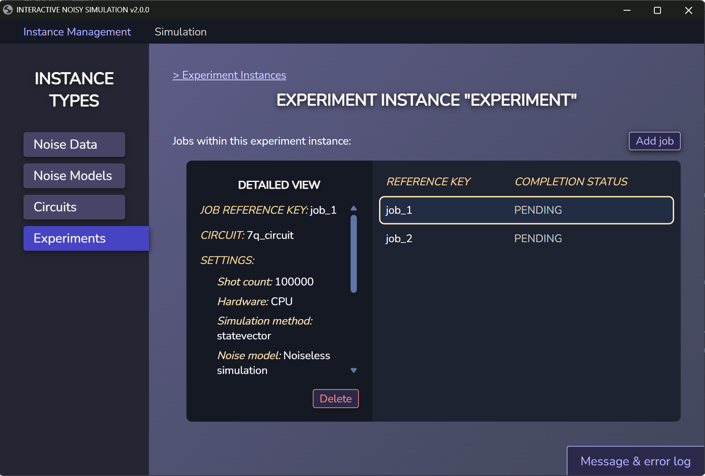
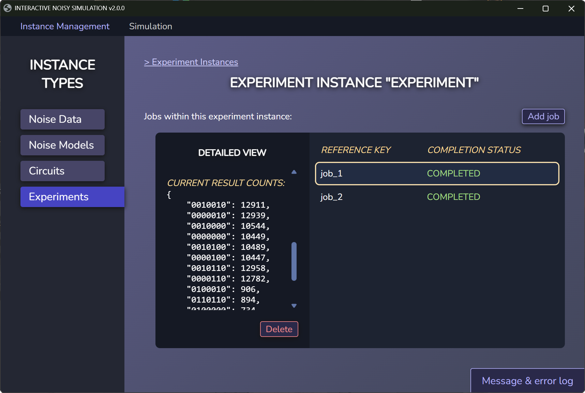

# Interactive Noisy Simulation Module

The module ***Interactive Noisy Simulation*** (further on referred to as ***INS***) provides an interactive workflow with the help of an intuitive GUI, allowing users to easily create and run experiments through simulators provided by *Qiskit*.

The backbone for all quantum computer simulation functionality comes from the following *Qiskit* *Python* packages: ***qiskit*** and ***qiskit-aer***.

Base functionality for the GUI was achieved through the *Python* package ***Eel***.

## 1. Functionality overview

*INS* currently provides the ability to:
- Import CSV calibration data files obtained from any of the available *IBM Quantum Platform* QPUs and create noise models from them;
- Import *Qiskit* `QuantumCircuit` objects as `.qpy` files;
- Create custom jobs that can be either noiseless or they may use any of the created noise models through *INS* to run any of the imported circuits. Each job also has additional settings for configuring circuit transpilation optimization, as well as selecting a specific simulation method that will be used for the specific job;
- Execute experiments (groups of jobs) through a queue and obtain shot counts for each experiment job.


## 2. Setup guide

### 2.1. Versions & dependencies

In order to install *INS*, the environment has to have the following Python version:
- *`Python >= 3.13`*

The module currently requires the following dependencies of third party packages / libraries:
- *`pandas >= 2.3.1`* - storing and using CSV calibration data as `pandas.DataFrame` objects
- *`qiskit >= 2.1.1`* - quantum computer simulation functionality
- *`qiskit-aer >= 0.17.1`* - quantum computer simulation functionality
- *`requests >= 2.32.5`*
- *`rich >= 14.2.0`* - terminal output styling
- *`rich-argparse >= 1.7.2`* - terminal output styling
- *`eel >= 0.18.2`* - GUI functionality & communication between Python and JavaScript
- *`jinja2 >= 3.1.6`* - HTML templates
- *`MarkupSafe >= 3.0.3`* - dependency of *`jinja2`*
- *`psutil >= 7.0.0`* - obtaining available memory on users device for setting simulation restrictions

If any of these dependencies are not set up prior to installing *INS*, they will be automatically downloaded and installed to the current environment.

**Additional notes regarding *Python* and dependencies:** 
- Some packages like *Qiskit* have not been tested with older versions than the ones mentioned in the dependencies. Therefore, even if they could work, the minimum version has been set to the one that was used during development. The same goes for *Python*.
- There might be potential errors because of specific updates to the packages *INS* depends on. As well as issues might be caused by these packages not yet being adapted to a new *Python* version. In these cases, the exact versions mentioned in the list above should be installed. The project was developed with them, which means that everything should work.

### 2.2. Module setup

1. There are currently no plans of publishing *INS* to *PyPI*, which means that it is required to do either of the following:
    - Get package link of latest release.
    - Download a stable version from the releases.

2. Based on the choice at step 1, use `pip` to install the package with one of the following ways:
    ```
    pip install relevant_version_link
    pip install ./path/to/downloaded/file
    ```
3. After successfully installing *INS*, you can run it through a terminal via:
    ```console
    interactive_noisy_simulation --start
    ```

### 2.3. Package updating & terminal commands

#### IMPORTANT: Installed *INS* version must be at least 1.2.2 for this to be available.

The package also includes functionality for a few terminal commands:
- `interactive_noisy_simulation -h | --help`: The usual `help` command behavior.
- `interactive_noisy_simulation -v | --version`: Retrieves the current version of INS.
- `interactive_noisy_simulation -u | --update`: If a newer version exists, automatically updates the package to it.

## 3. Guided walkthrough and explanation of a sandard *INS* workflow

The following sub-sections cover the main workflow that the user would have with explanations of the most important concepts of *INS* functionality.

### 3.1. Instance management

The default page that opens upon starting INS is `Instance Management`. Through the side navigation bar, the user can navigate to specific instance type management pages, which include:
- **`Noise data`** - QPU calibration data instances that are created from importing CSV data files;
- **`Noise models`** - Instances that are created from Noise data instances and contain *Qiskit* `NoiseModel` and `CouplingMap` objects;
- **`Circuits`** - Instances created by importing *Qiskit* `QuantumCircuit` objects in the form of `.qpy` files;
- **`Experiments`** - An instance type meant for grouping **jobs** (sub-instances for experiments).

 Noise Data`" 
     width="600">

**Figure 1.** Example image of the default page - `Instance Management > Noise Data`.

The workflow includes creating any required instances in the order that they were just described. Everything should be straightforward as the UI of INS is made to be intuitive and simple.

### 3.2. Job creation for experiment instances

**Jobs** are the specific tasks that simulators will be executing and each experiment may contain any number of jobs within it.

To create a job, the user must navigate to the `Experiments` instance type management. Each created experiment instance has an action called `View`. Upon clicking it, the user arrives at the page, where job instances can be created for the specific experiment.



**Figure 2.** Example image of the job creation form.

After job instances are created, the user can click through them on the same page to view detailed information about the selected job.



**Figure 3.** Example image of detailed experiment job view.

**NOTE**: The term **Job** in context of *INS* is a custom object that does not align with what *Qiskit* may refer to in the scope of their functionality, as there are differences for how it has been implemented here, in *INS*.

### 3.3. Executing jobs

Once all required experiments are created, the user must navigate to the **Simulation** page through the main navigation bar. There, experiments can be added to the **execution queue**, which can be then started by clicking the button ***Execute queued jobs***.


**Figure 4.** Example image of the `Simulation` page.

There are progress bars on the right side of the **Simulation** page that track how far away from completion is:
- The entire execution queue;
- The experiment being currently executed;
- The job being currently executed.

### 3.4. Obtaining results

After the simulation process has concluded, the user must navigate back to `Instance Management > Experiments > View` for any specific experiment instance. Once there, any of the Job instances can be clicked, loading in their detailed preview. After scrolling down on the left side of the page content, there will be a label called `CURRENT RESULT COUNTS`, and under it will be all shot counts for the completed job.



**Figure 5.** Example image of visible shot counts within detailed job view.

## 4. Things to note

### 4.1. Dependency on Python packages / libraries or other factors

While the functionality is currently working, it is highly dependent on [IBM Qiskit](https://github.com/Qiskit/qiskit) and other related things like the [IBM Quantum Platform](https://quantum.cloud.ibm.com/). Any significant changes to their code might break the current functionality of *INS*.

If there are any significant format changes for the downloadable calibration data CSV files, who are not tied to any library / module version, there will need to be manual adjustments within `csv_columns.json`.

### 4.2. Importing circuits from older versions of *Qiskit*
While developing *INS*, the following error has been encountered: 
```
The QPY format version being read, {version_number}, isn't supported by this Qiskit version. Please upgrade your version of Qiskit to load this qpy payload
```
This means that there is no issue with importing circuits from older versions, however, it will raise this error if a circuit `.qpy` file was created through an environment with a newer *Qiskit* version than the one being used by *INS*.

This isn't something that can be fixed on the side of *INS*, which means the user should resolve issues related to this, if they appear. This information is mentioned here as an explanation of the situation.

### 4.3. Automatically-updating radio input fields
When creating a job for an experiment, additional validation happens, affecting what kind of radio input options will appear. These things are currently not explained anywhere through the UI of INS, thus they will be mentioned here:
- **Selecting a circuit instance will check which noise model instances support it**. If a quantum circuit has more qubits than the noise model, it will not be shown as an option.
- **Selecting a circuit instance will check which simulation methods are capable of running it**. Quantum computer simulation is expensive, especially with bigger qubit counts, as it requires a lot of memory (RAM), thus *INS* calculates the required memory for those methods, where it is straightforward to do so (`statevector` and `density_matrix`);
- **Selecting a simulation method will check what kind of hardware options are available for it** (not all simulation methods support all available hardware options).

In cases, where an option was previously selected before any validation took place, one of the following scenarios will play out:
- If the previously selected option is still available, it will remain selected in that specific input field;
- If the previously selected option is no longer available, no option will be selected in that specific input field.

### 4.4. Different simulation method speeds
Since this is not currently mentioned anywhere in the UI of *INS*, it will be mentioned here.

From what has been tested, each of the supported simulation methods has a different execution speed:
- `density_matrix` - completes jobs the fastest, but requires the most memory;
- `statevector` - is noticeably slower than `density_matrix`, but also requires quite a bit less memory (can simulate 2x the amount of qubits);
- `matrix_product_state` - the slowest one (especially with noise). Though the benefit of it is the fact that it can simulate way more qubits than the `statevector` method.

### 4.5. Non-calculable memory (RAM) requirements and potential errors
Even though it is possible to precisely calculate how much RAM is required to run a circuit with the `statevector` and `density_matrix` simulation methods, there are other situations, where something like this may not be possible (or at the very least, not accomplishable without a complicated solution that might take lots of time to create and implement).
- **`matrix_product_state`** - The memory requirements of this method are dynamically altered not just by the number of qubits in the circuit, but also the overall entanglement and depth (at least from what I have understood up until the point of writing this). I am also not sure if *Qiskit* functionality will stop this circuit from running successfully if the memory requirements suddenly exceed the available memory (even though this was not tested, the next point might imply that this would happen). In any case, an additional argument / setting is also given to each created simulator instance through INS - `max_memory_mb` (calculated based on available RAM of the used device);
- Large circuit transpilation has caused an error to be raised in regards to some sort of memory-related issue (`MemoryError`). This was encountered while doing some tests with the `matrix_product_state` method. Similarly as with the previous point, I do not currently know of any optimal way to prevent this from happening, other than limiting, let's say, the number of qubits or depth of the circuit. But as it stands, no restrictions for this have been set by *INS*.

### 4.6. GPU functionality and `tensor_network` simulation method support

As of writing this, there is no official support from *INS* to use GPU as a hardware option for the *Qiskit* simulator `AerSimulator`. With that being said, there are also no restrictions for it (it is not being prevented) in *INS*.

If anyone is willing, you can try to remove `qiskit-aer` and install `qiskit-aer-gpu` in its place after successfully setting up *INS*. In theory, this could work, though I am not able to test it out myself at this moment in time.
